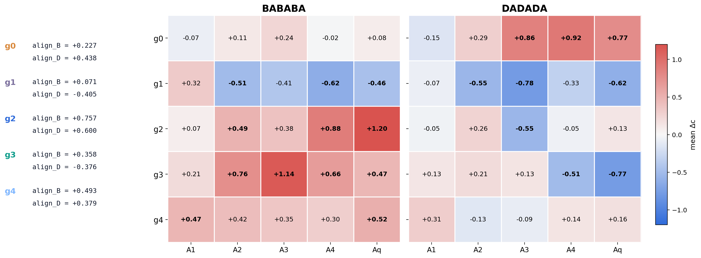
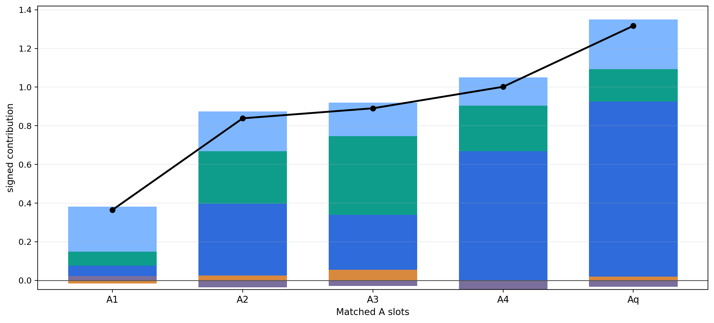
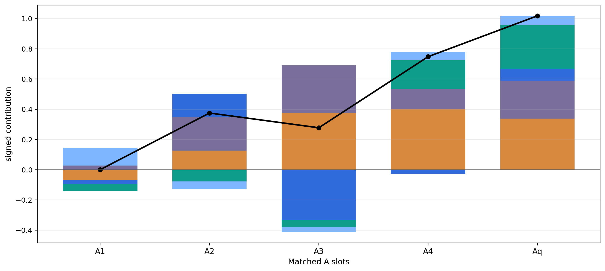
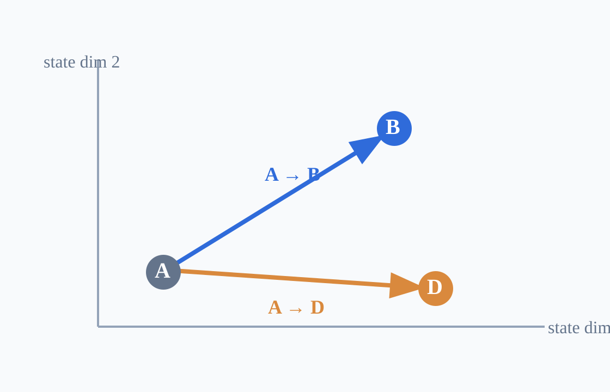

# Which Inside-A Features Change Over Steps?

Inside-A carries most of the stepwise change. The next question is which A-features are being reweighted across matched A slots.

<strong>Takeaway.</strong> Inside A, the same role-defined features do not stay fixed: <code>g2/g3/g4</code> are amplified along the B branch, while the D branch strengthens <code>g0</code> and suppresses anti-D axes such as <code>g1</code> and <code>g3</code>.

---

# BABABA: Which Features Drive the B-Directed Drift?

Contribution asks not just which features changed, but which of those changes actually pushed the state toward B. Each colored segment shows how much one inside-A feature contributes to that B-directed drift, relative to the AAA baseline. Segments above zero support B-directed drift; segments below zero oppose it.

g0
g1
g2
g3
g4
total

---

# DADADA: Which Features Drive the D-Directed Drift?

Contribution asks not just which features changed, but which of those changes actually pushed the state toward D. Each colored segment shows how much one inside-A feature contributes to that D-directed drift, relative to the AAA baseline. Segments above zero support D-directed drift; segments below zero oppose it.

g0
g1
g2
g3
g4
total

---

# A Shepard-Like Geometric Substrate

<strong>Relational states are organized in a geometric state space.</strong>

Their differences define meaningful directions, allowing us to measure movement toward endpoints such as <code>A→B</code> and <code>A→D</code>.

This is why progress, alignment, and endpoint-directed movement are meaningful quantities in our analysis.

States occupy positions; differences define directions.

